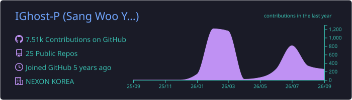

  <a href="https://blog.swyang.dev"><samp>blog</samp></a>&nbsp;&nbsp;·&nbsp;&nbsp;
  <a href="https://maeil.swyang.dev"><samp>매일열장</samp></a>&nbsp;&nbsp;·&nbsp;&nbsp;
  <a href="https://medium.com/@dndb3599"><samp>medium</samp></a>&nbsp;&nbsp;·&nbsp;&nbsp;
  <a href="https://velog.io/@dndb3599"><samp>velog</samp></a>

<h3><samp>$ ls ~/stack</samp></h3>

  

<h3><samp>$ tail -n 5 ~/blog</samp></h3>

<!-- BLOG-POST-LIST:START -->
- [노드 900개짜리 그래프 그리기 — 안 죽고, 안 멈추고, 알아볼 수 있게](https://blog.swyang.dev/posts/drawing-a-900-node-graph) — 2026-08-25
- [『인간 실격』—힛치 올드앤뉴 북토크](https://blog.swyang.dev/posts/no-longer-human) — 2026-08-25
- [「지속하는 힘은 어디서 오는가」—사내 북토크 기록](https://blog.swyang.dev/posts/jisokhaneun-himeun-eodiseo-oneunga) — 2026-08-24
- [『싯다르타』—힛치 올드앤뉴 독서 모임 4회차](https://blog.swyang.dev/posts/sitdareuta-hitchi) — 2026-07-25
- [『알로하, 나의 엄마들』—힛치 올드앤뉴 독서 모임 3회차](https://blog.swyang.dev/posts/alroha-naui-eommadeul) — 2026-07-13<!-- BLOG-POST-LIST:END -->

<samp>→ more at <a href="https://blog.swyang.dev">blog.swyang.dev</a></samp>

<h3><samp>$ git log --stat</samp></h3>

  

