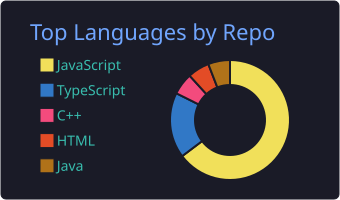
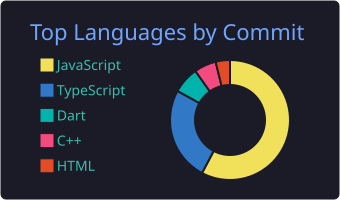

<div align="center">


<a href="https://blog.swyang.dev">
  
</a>

<br/>

[](https://blog.swyang.dev)
[](https://maeil.swyang.dev)
[](https://medium.com/@dndb3599)
[](https://velog.io/@dndb3599)

</div>

```javascript
const dan = {
  work: "NEXON KOREA — Software Engineer / Game Developer",
  previously: ["Kakao", "Danbi Edu (단비교육)"],
  building: ["blog.swyang.dev — human writes, AI builds",
             "maeil.swyang.dev — 매일열장, a reading-habit app",
             "24/7 home-lab AI agents on k3s"],
  motto: "Talk is cheap. Show me the code.",
}
```

<div align="center">

### 🛠 Stack


### 📝 Latest from my blog

</div>

<!-- BLOG-POST-LIST:START -->
<!-- BLOG-POST-LIST:END -->

<div align="center">

➡️ more at <a href="https://blog.swyang.dev"><b>blog.swyang.dev</b></a>

### 📊 GitHub






</div>
